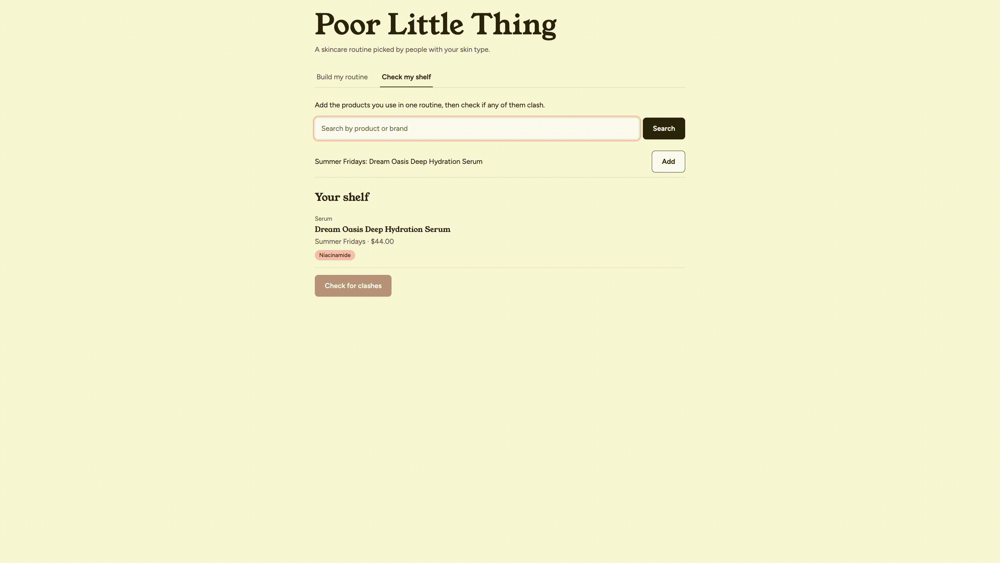
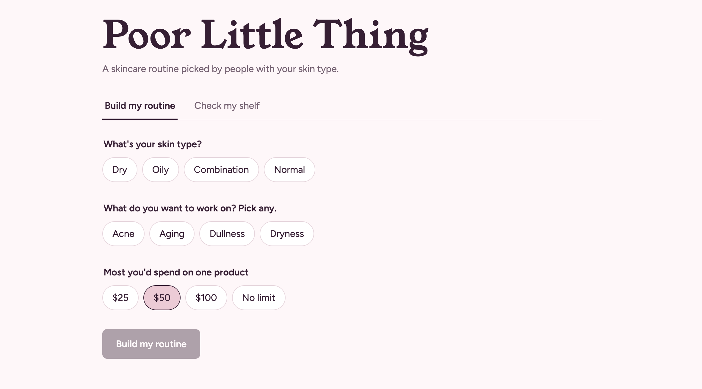
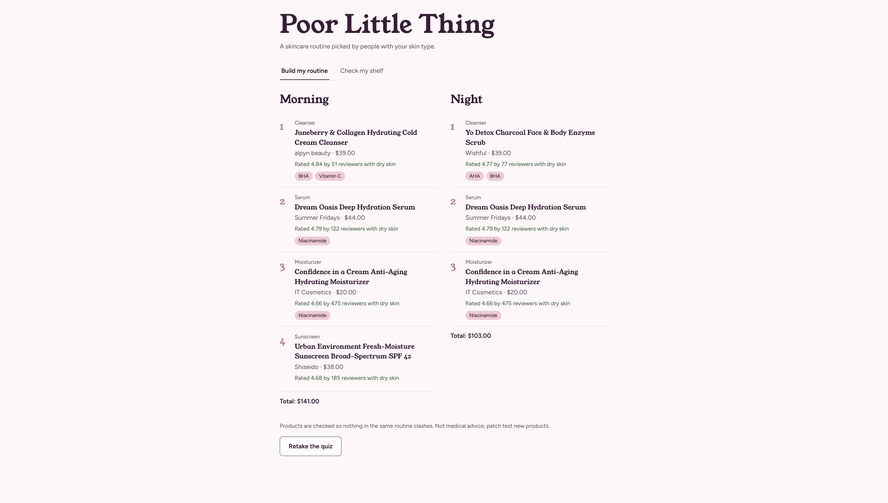
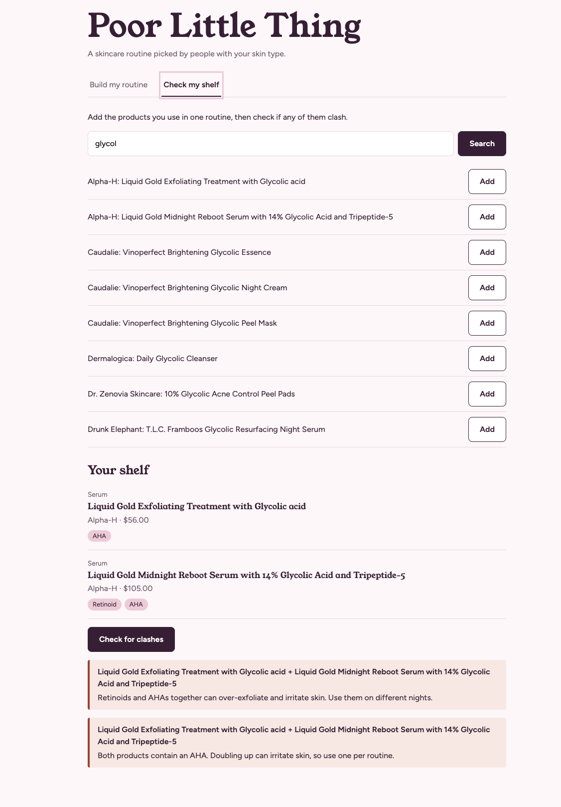

# Poor Little Thing

Take a 30-second skin quiz and get a morning and night skincare routine built from
real Sephora products, ranked by reviewers with your skin type, with no clashing actives.

**Live app:** https://poor-little-thing.vercel.app

**API docs:** https://YOUR-RENDER-URL.onrender.com/docs



## Features
- Personalized morning and night routines from 1,754 Sephora skincare products
- Rankings based on ~811,000 reviews, split by reviewer skin type
- Ingredient-conflict checker for retinoids, AHAs, BHAs, vitamin C, and benzoyl peroxide
- "Check my shelf": search products you own and check them for clashes

| Quiz | Routine | Clash check |
| --- | --- | --- |
|  |  |  |

## Tech stack
React + Vite (Vercel) · Python + FastAPI (Render) · pandas · pytest (14 tests)

## How it works
1. `data/clean.py` turns the raw Kaggle CSVs (8,494 products, 1M+ reviews) into one
   JSON file with each skincare product's routine step, detected actives, and
   average rating per skin type.
2. The recommender scores products with a Bayesian average, so a product with a
   few 5-star reviews doesn't beat one with thousands of 4.6-star reviews.
3. It picks the best product for each step and skips anything that clashes with
   products already in that routine. Retinoids and AHAs stay out of the morning
   because they increase sun sensitivity.

## Run it locally
Requires Python 3.12+ and Node.js 20+.

```bash
# Back end
python3.12 -m venv .venv
source .venv/bin/activate
pip install -r backend/requirements.txt
cd backend
pytest
uvicorn main:app --reload
```

```bash
# Front end (in a second terminal)
cd frontend
npm install
npm run dev
```

Then open http://localhost:5173.

To rebuild the data, download the dataset below into `data/raw/`,
run `pip install pandas`, then `cd data && python clean.py`.

## Limitations and next steps
- Data is from March 2023, so prices and stock may be out of date
- Active detection is keyword-based (lactic acid, for example, can appear as a pH adjuster)
- Next: a dupe finder that matches cheaper products by ingredient similarity

## Credits
Data: [Sephora Products and Skincare Reviews](https://www.kaggle.com/datasets/nadyinky/sephora-products-and-skincare-reviews)
by Nady Inky, CC BY 4.0. Not affiliated with Sephora.